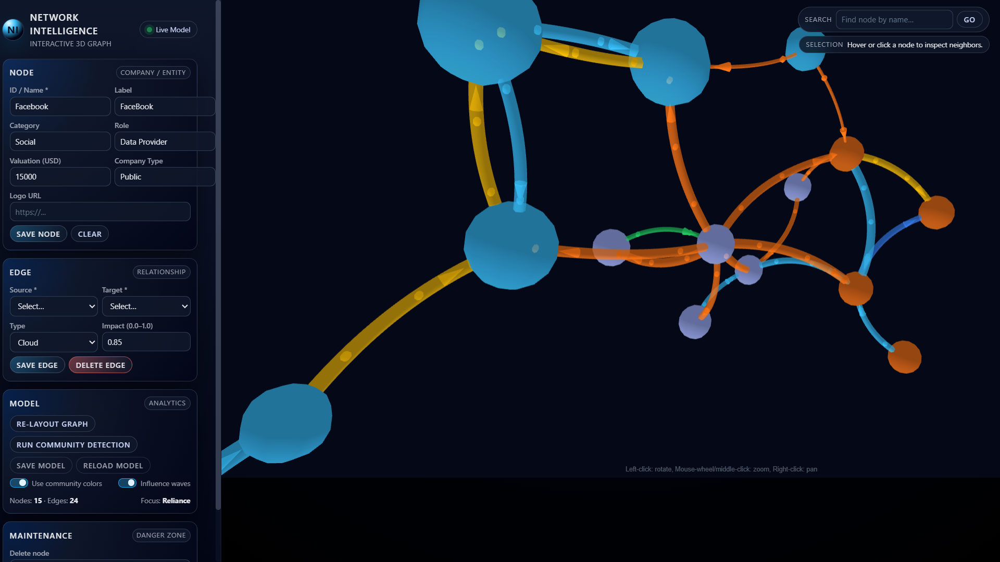
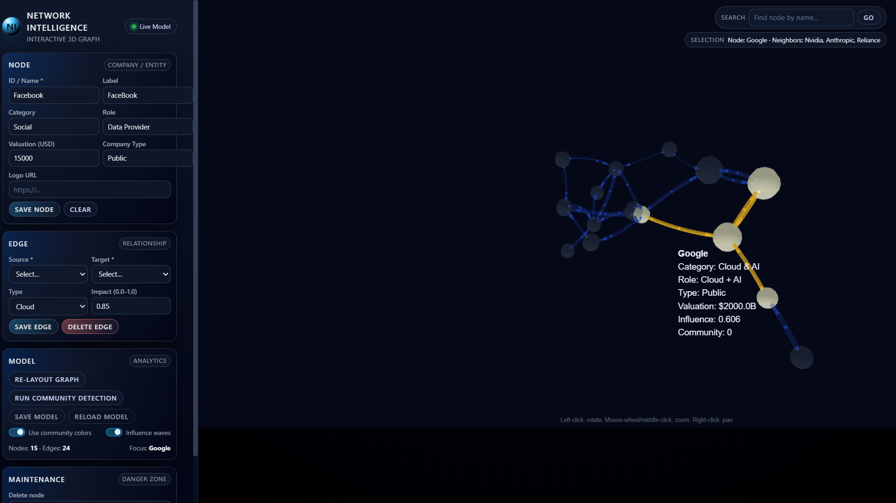

# 3D Network Intelligence – Interactive Graph Visualizer

A professional, interactive **3D WebGL network visualization system** for exploring company relationships, dependency graphs, and network intelligence.


## ScreenShot:

<div style="display: flex; overflow-x: auto; gap: 10px;">
  
  
</div>

## ✨ Features

### Core Capabilities
- **3D WebGL Visualization** using `3d-force-graph` (Three.js)
- **Real-time Graph Editing** - Add, modify, and delete nodes and edges
- **Smart Node Sizing** - Automatically scaled by influence (centrality algorithms)
- **Community Detection** - Automatic clustering using modularity optimization
- **Relationship Typing** - Color-coded edges by relationship type
- **Impact Flow Animation** - Visual particle flow showing influence direction
- **Persistent Storage** - JSON-based graph saving and loading
- **Dual Interface** - Browser-based or native desktop application

### Advanced Features
- **Influence Analysis** - Eigenvector and degree centrality calculations
- **Interactive Search** - Find and focus on specific nodes
- **Neighbor Highlighting** - Show direct connections on hover
- **Context Menus** - Right-click actions on nodes
- **Custom Styling** - Community or category-based coloring
- **Physics Simulation** - Configurable force-directed layout
- **Rich Tooltips** - Detailed node information on hover

---

## 🚀 Quick Start

### Prerequisites
- Python 3.10 or higher
- pip package manager

### Installation

1. **Clone the repository**
```bash
git clone <repository-url>
cd network-intelligence
```

2. **Create a virtual environment** (recommended)
```bash
python -m venv venv

# On Windows:
venv\Scripts\activate

# On macOS/Linux:
source venv/bin/activate
```

3. **Install dependencies**
```bash
pip install -r requirements.txt
```

### Running the Application

**Option 1: Browser-based (Recommended)**
```bash
python app.py
```
Select "Open in Browser" when prompted. The application will launch at `http://127.0.0.1:5000/`

**Option 2: Desktop Application**
```bash
python app.py
```
Select "Open Desktop App" when prompted for a native window experience.

---

## 📁 Project Structure
```
network-intelligence/
├── app.py                          # Main application entry point
├── requirements.txt                # Python dependencies
├── config.py                       # Configuration management
├── README.md                       # This file
│
├── core/                           # Core business logic
│   ├── __init__.py
│   ├── graph_model.py             # Graph data structure & analytics
│   ├── node.py                    # Node entity definition
│   └── analytics.py               # Network analysis algorithms
│
├── visualization/                  # Visualization layer
│   ├── __init__.py
│   ├── network_visualizer.py     # 3D graph data preparation
│   ├── color_schemes.py          # Color palettes and themes
│   └── physics_settings.json     # Physics configuration
│
├── api/                           # Web API layer
│   ├── __init__.py
│   ├── routes.py                 # Flask route definitions
│   └── controllers.py            # Request handlers
│
├── ui/                           # User interface
│   ├── desktop/                  # Desktop app
│   │   ├── __init__.py
│   │   └── tk_app.py            # Tkinter/webview app
│   │
│   └── web/                     # Web interface
│       ├── static/
│       │   ├── css/
│       │   │   └── style.css    # Styling
│       │   └── js/
│       │       ├── app.js       # Main application logic
│       │       └── graph.js     # Graph interaction logic
│       │
│       └── templates/
│           └── index.html       # Main HTML template
│
├── storage/                     # Data persistence
│   ├── __init__.py
│   ├── io_manager.py           # Save/load operations
│   └── default_network.json   # Demo network data
│
└── utils/                      # Utility functions
    ├── __init__.py
    ├── logger.py              # Logging configuration
    └── validators.py          # Input validation
```

---

## 📊 Usage Guide

### Adding Nodes

1. Fill in the **Node** panel:
   - **ID/Name** (required) - Unique identifier
   - **Label** - Display name (optional)
   - **Category** - Type of entity (e.g., "AI Lab", "Cloud Provider")
   - **Role** - Function in network
   - **Valuation** - Numeric value (USD)
   - **Company Type** - Public, Private, Startup, etc.

2. Click **Save Node**

### Creating Relationships

1. In the **Edge** panel:
   - Select **Source** and **Target** nodes
   - Choose **Relationship Type**:
     - Hardware - Hardware supply relationships
     - Software - Software dependencies
     - Investment - Funding relationships
     - Cloud - Cloud service provision
     - Services - Service relationships
     - VC - Venture capital
     - Research - Research collaborations
   - Set **Impact** (0.0-1.0) - Strength of relationship

2. Click **Save Edge**

### Analytics Operations

- **Re-layout Graph** - Reset physics simulation
- **Run Community Detection** - Automatic clustering
- **Toggle Community Colors** - Switch between category and cluster coloring
- **Influence Waves** - Animated particle flow

### Navigation

- **Mouse Drag** - Rotate view
- **Scroll** - Zoom in/out
- **Click Node** - Focus and center
- **Hover Node** - Highlight neighbors
- **Right-click** - Context menu
- **Search** - Find node by name/ID

---

## ⚙️ Configuration

### Physics Settings (`visualization/physics_settings.json`)
```json
{
  "backgroundColor": "#050816",
  "nodeSizeMin": 4,
  "nodeSizeMax": 20,
  "linkCurvature": 0.3,
  "linkOpacity": 0.8,
  "linkWidthFactor": 3.5,
  "arrowLength": 5,
  "particleSpeed": 0.007,
  "velocityDecay": 0.25
}
```

### Environment Variables (`config.py`)
```python
# Server configuration
HOST = "127.0.0.1"
PORT = 5000
DEBUG = False

# Storage
DATA_DIR = "storage"
DEFAULT_FILE = "default_network.json"

# Visualization
ENABLE_3D = True
ENABLE_ANIMATIONS = True
```

---

## 🔧 Advanced Usage

### Custom Data Import
```python
from core.graph_model import GraphModel
from core.node import Node
from storage.io_manager import save_graph

# Create model
model = GraphModel()

# Add nodes
model.add_node(Node(
    id="Company1",
    label="Company One",
    category="Technology",
    valuation=1000000000
))

# Add edges
model.add_edge(
    source="Company1",
    target="Company2",
    relationship_type="investment",
    impact=0.8
)

# Save
save_graph(model, "my_network.json")
```

### Programmatic Analytics
```python
# Compute influence scores
model.compute_influence()

# Run community detection
model.compute_communities()

# Get node neighbors
neighbors = model.get_neighbors("Company1")

# Export to JSON
data = model.to_json()
```

---

## 🎨 Customization

### Color Schemes

Edit `visualization/color_schemes.py`:
```python
CATEGORY_COLORS = {
    "AI Lab": "#a855f7",      # Purple
    "Cloud": "#22c55e",        # Green
    "Hardware": "#f97316",     # Orange
    "VC": "#eab308",          # Gold
}

EDGE_COLORS = {
    "investment": "#eab308",   # Gold
    "hardware": "#f97316",     # Orange
    "software": "#3b82f6",     # Blue
}
```

### Custom Layouts

Modify force simulation parameters in `physics_settings.json`:

- `velocityDecay`: Simulation friction (0-1)
- `linkCurvature`: Edge curve amount
- `particleSpeed`: Animation speed
- `nodeSizeMin/Max`: Size range for nodes

---

## 🐛 Troubleshooting

### Issue: Graph not loading
**Solution**: Check browser console (F12) for errors. Ensure Flask server is running.

### Issue: Nodes overlapping
**Solution**: Click "Re-layout Graph" or increase `velocityDecay` in physics settings.

### Issue: Performance issues with large graphs
**Solution**: 
- Disable "Influence Waves" for better performance
- Reduce `nodeSizeMax` and `linkWidthFactor`
- Consider filtering nodes to show top N by influence

### Issue: Desktop app not opening
**Solution**: Install webview: `pip install pywebview`

---

## 📈 Performance Tips

1. **Large Networks (>100 nodes)**:
   - Disable particle animations
   - Use community colors (faster rendering)
   - Increase velocity decay for faster stabilization

2. **Real-time Updates**:
   - Batch multiple edits before re-computing analytics
   - Use the API endpoints for bulk operations

3. **Memory Usage**:
   - Regularly save and reload for fresh start
   - Clear browser cache if experiencing slowdowns

---

## 🧪 Testing

Run tests:
```bash
pytest tests/
```

Run with coverage:
```bash
pytest --cov=core --cov=visualization tests/
```

---

## 🤝 Contributing

1. Fork the repository
2. Create a feature branch (`git checkout -b feature/amazing-feature`)
3. Commit changes (`git commit -m 'Add amazing feature'`)
4. Push to branch (`git push origin feature/amazing-feature`)
5. Open a Pull Request

---

## 📝 License

This project is licensed under the MIT License - see the [LICENSE](LICENSE) file for details.

---

## 🙏 Acknowledgments

- **3d-force-graph** by Vasco Asturiano
- **NetworkX** for graph algorithms
- **Flask** web framework
- **Three.js** for 3D rendering

---

## 📧 Contact

For questions or support, please open an issue on GitHub.

---

## 🗺️ Roadmap

- [ ] Multi-graph support
- [ ] Time-series network evolution
- [ ] Export to common formats (GraphML, GEXF)
- [ ] Advanced filtering and search
- [ ] Collaborative editing
- [ ] API authentication
- [ ] Docker deployment
- [ ] Cloud storage integration

---

**Built with ❤️ for network analysis and visualization**